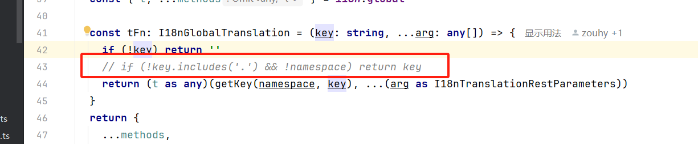

# Vue3 + Vite 多语言自动替换插件

这是一个 Vue3 + Vite 插件，旨在实现多语言自动替换功能。插件能够自动识别 Vue 组件中的中文文本，并将其替换为相应的国际化函数调用，以支持多语言。

## 功能特点

- 自动提取 Vue 模板和脚本中的中文文本。
- 将提取的中文文本替换为国际化函数调用。
- 支持处理 `.vue`、`.js`、`.ts`、`.jsx` 和 `.tsx` 文件。
- 在开发模式下实时更新语言文件。
- 在构建时创建新的语言包。

## 安装

```javascript
npm install rollup-i18n-auto-create-plugin
# 或者
yarn add rollup-i18n-auto-create-plugin
```
## 使用方法

```javascript
import RollupI18nCreatePlugin from 'rollup-i18n-auto-create-plugin'

export default defineConfig({
  plugins: [
    RollupI18nCreatePlugin({
      i18nPath: 'src/locales/zh-CN.ts',
      langPath: ['src/locales/en.ts'],
      injectToJS: `import { useI18n } from '@/hooks/web/useI18n'\nconst { t } = useI18n()`,
      excludes: ['locale', 'useI18n', 'node_modules'],
      jsText: 't',
      tempText: 't',
      regi18n: 'useI18n'
    }),
  ]
})
```

## 选项说明
- i18nPath: 语言文件的路径。
- langPath: 打包的时候处理语言文件的路径数组。
- tempText: （可选）模板文本。
- excludes： (可选) 排除文件名称。
- jsText: （可选）JavaScript 模板文本。
- regi18n: 判断是否要出入以来的文本，如果已经有就不需要插入，存在如果是注释的时候没有办法兼容。
- injectToJS: （可选）要注入到 JavaScript 中的文本。

```javascript
  i18nPath: string
  langPath: string[]
  regi18n: string
  excludes: string[]
  tempText: string
  jsText: string
  injectToJS: string
```

## 工作原理
插件使用 @vue/compiler-sfc 解析 Vue 文件，并递归遍历 AST 以提取中文文本。对于 JavaScript 脚本，插件使用 Babel 解析和遍历 AST。提取的中文文本将被替换为国际化函数调用。

## 注意
> 该项目的默认配置是针对 [element-plus-admin](https://element-plus-admin.cn/) 项目，
> 在其他项目中没有认真测试过

1、针对 element-plus-admin 的项目修改
- src/hooks/web/useI18n.ts


2、在开发环境中使用该插件项目会比较卡顿，而且在修改中文的时候整个页面会在5s后才刷新因为这里我用了防抖，所以建议在生成环境中才开启

- 打包命令整理多语言库
> "build:lang": "pnpm vite build --mode lang"
> 
> --mode lang 我获取 lang 作为整理标签


## 许可证
MIT

```javascript
请根据实际情况调整上述内容。如果您有其他需要添加的信息或者有特定的格式要求，请告诉我。
```
